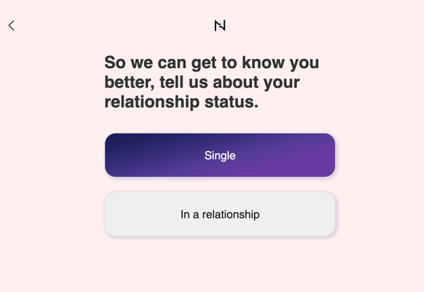

<h1 align="center">Survey Test App</h1>

<h2 align="center">

</h2>

### Description

---

This project is a demo application for surveys, built using Next.js, Typescript and Redux Toolkit. This [Next.js](https://nextjs.org/) project bootstrapped with [`create-next-app`](https://github.com/vercel/next.js/tree/canary/packages/create-next-app).

## Getting Started

### Running in Development Mode

1. Clone the repository:
    ```bash
    git clone <THIS_REPOSITORY_URL>
    ```

2. Navigate to the project directory:
    ```bash
    cd survey-test-app
    ```

3. Install dependencies:
    ```bash
    npm install
    # or
    yarn install
    # or
    pnpm install
    # or
    bun install
    ```

4. Start the development server:
    ```bash
    npm run dev
    # or
    yarn dev
    # or
    pnpm dev
    # or
    bun dev
    ```

5. Open [http://localhost:3000](http://localhost:3000) in your browser to see the result.

### Running in Production Mode

To run the project in production mode, follow these steps:

1. Build the project:
    ```bash
    npm run build
    # or
    yarn build
    # or
    pnpm build
    # or
    bun build
    ```

2. Start the server:
    ```bash
    npm start
    # or
    yarn start
    # or
    pnpm start
    # or
    bun start
    ```

## Usage

- **Next.js**: Framework for server-side rendering and static site generation.
- **Redux Toolkit**: Library for state management.
- **Sass**: CSS preprocessor for improved styling.
- **ESLint**: Tool for identifying and fixing problems in JavaScript and TypeScript code to ensure code quality and consistency.
- **Prettier**: Code formatter that enforces consistent style by parsing your code and re-printing it with its own rules.

This project uses [`next/font`](https://nextjs.org/docs/basic-features/font-optimization) to automatically optimize and load Inter, a custom Google Font.

### Additionally
 - The configuration of the survey (questions, answers, transition conditions between questions) can be found in the **src/data/surveys.ts** file
 - If the project will be expanded, it is better to use the **react-svg** library for icons
 - Now, when a user refreshes the page during a survey, they are redirected to the first question. In the future, their data will be stored in a database or cookies, so this logic will need to be changed
## Learn More

To learn more about Next.js, take a look at the following resources:

- [Next.js Documentation](https://nextjs.org/docs) - learn about Next.js features and API.
- [Learn Next.js](https://nextjs.org/learn) - an interactive Next.js tutorial.

You can check out [the Next.js GitHub repository](https://github.com/vercel/next.js/) - your feedback and contributions are welcome!

